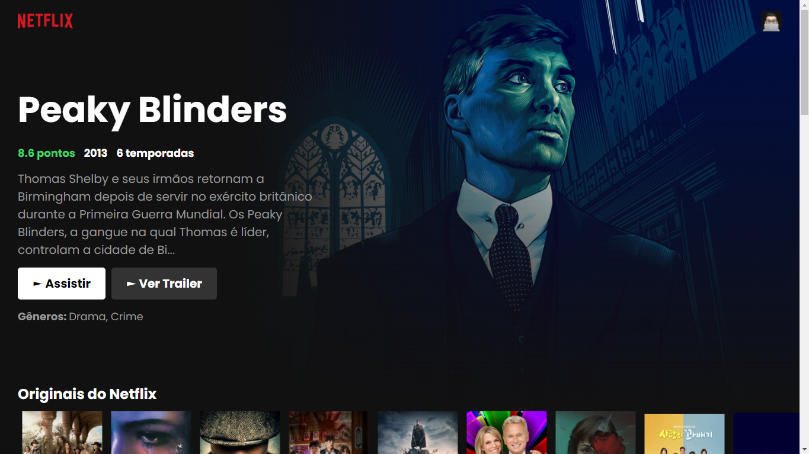

<p align="center">
  <a href="https://netflix-iamdevmarcos.vercel.app/">
    
  </a>
</p>

# UI Netflix

> a clone of netflix, made with **ReactJS** and **Styled-Components**

Be sure to send your feedback...

## Technology stack

- **Front-end:** [React.Js](https://reactjs.org/)
- **Deployment:** [Vercel](https://vercel.com/)
- **Build:** [CRA](https://create-react-app.dev/)

## Test Online

[Click Here](https://netflix-iamdevmarcos.vercel.app/)

## Running locally

1. Clone this repo:

```sh
$ git clone https://github.com/iamdevmarcos/react-netflix.git
```

2. Then go to the project's folder:

```sh
cd react-netflix
```

3. Install all dependencies:

```sh
npm install
```

4. Run locally:

```sh
npm start
```

## Autor

| [<br><sub>@iamdevmarcos</sub>](https://github.com/iamdevmarcos) |
